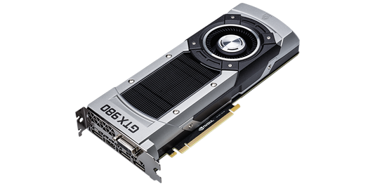
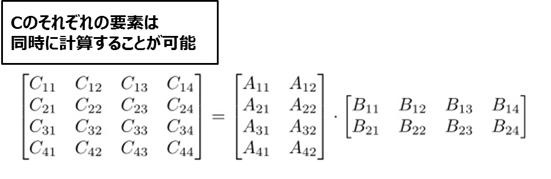
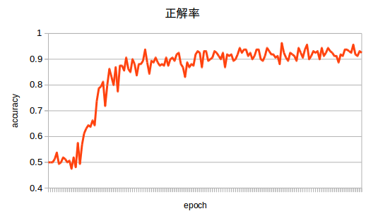

# GPUで機械学習～うわっ・・・私のモデル、正解率低すぎ・・・？〜

<<<

## はじめに
昨年にGoogleがTensorFlowをリリースしたのをきっかけに、Deep Learning（以下DLと略）関連の記事がQiitaやはてなブログで増えてきました。しかしそこまで普及しても、人によっては「GPU？低レイヤ？C++なの？難しそう」といった印象を持たれている人も多いようです。なので本記事では、GPUのわかりやすーい説明とChainerを使ったモデル判定をやってみようと思います。

## GPUと機械学習
== GPU
「そもそもGPUってよくわかってないんだけど？」という方もけっこういるみたいです。GPUとはGraphics Processing Unitの略称です。「CPUと何が違うの？」みたいなこともよく聞かれます。簡単に書くと、GPUは画像処理専用のプロセッサのことです。ここでは、画像処理とはCG（コンピュータグラフィックス）とか3Dゲームとかと思ってください。CPUがコンピュータ全体を制御する中枢で、GPUがお絵かきやゲームを表示したりしてくれる部品です。よく「グラボ」と言われているパーツがあると思いますが、あのグラボの中にGPUが組み込まれています。 +

.グラフィックスボード


GPUはゲームなどのCGを高速に描画するために進化してきました。例えば物体の移動・光の反射による色の変化など、滑らかに表示するためにそれらを高速に計算する必要があるからです。これらはベクトルの計算で、ベクトルの計算は数式だと行列の加算や乗算で表現できます。つまり、GPUは行列の演算を高速に行うことができるのです。また、行列の計算は行列の各要素に対して同じ計算を実施することとなります。つまり、GPUは同じ計算を大量のデータに対して実施することに特化しています（図２）。もちろんCPUでも演算は可能ですが、GPUほど特化した構造になっていないため、3Dゲームをプレイしようとしても、計算が間に合わずカクついたり、そもそもプレイできないこともあります。

.行列の演算


== GPGPU
「そんな3Dゲームに使う代物が、なんで機械学習とかDLの分野でよく出てくるの？」と思っている方もいるでしょう。その前に、GPGPUという技術について説明します。 +
GPGPUとは、General Purpose computing on GPUの略です。GPUコンピューティングとも呼ばれたりします。これは、GPUにCG以外の計算を実施してもらう応用技術です。前節で述べたように、GPUは大量のデータに同じ計算を素早く実施することに特化しています。ゲームだけにこの演算パワーを使うのはもったいないので、数値計算にも使ってしまえば、並列数が多い計算ではCPUより高速に結果を得られることがあります。 +
GPGPUは、最初はCGの命令を上手く使って計算を行うという、変わったプログラミング方法で実現していました。しかし、NVIDIAがCUDAというGPGPU用の開発環境を提供してくれたおかげでGPGPUの敷居が下がり、様々な分野でGPUを利用する場面が増えました。

=== CUDAとOpenCL
ちなみに、筆者がよくGPGPUのアプリケーションを開発するときによく使っていたのは、OpenCLというフレームワークです。CUDAがNVIDIA専用の開発環境というのに対し、OpenCLはNVIDIA・AMDの両GPUでGPGPUが使えるというメリットがありました。しかし、OpenCLのプログラミングは非常に難易度が高く、容易に使えるものではありませんでした。また、GPGPUではAMDよりNVIDIAのほうがパフォーマンスチューニングがしやすかったり、デバッグツールなどが整っていたため、あまり普及することなく今はCUDA一強となってしましました。（FPGAなど組込の分野ではOpenCLは使われたりするそうです。）

== 機械学習とGPUの関係
機械学習になぜGPUがよく使われるのか簡単に説明します。 +
機械学習や流行りのDLの計算のほとんどは行列の演算になります。前節で述べたように、GPUは行列のような各要素に同じ計算を実施するような処理が得意です。

== Chainer
Chainer（http://chainer.org/）とは、Pythonのニューラルネットワーク用フレームワークです。国産のOSSとして知られていて、DLのコーディングがシンプルに書けるのが特徴です。
もう1つ有名なのは、2015年11月にGoogleが公開したTensorFlow（https://www.tensorflow.org/）です。Googleがサポートしていることや、TensorBoardという可視化ツールの存在もあり、Githubのスター数はTensorFlowの一人勝ちです。 +
「なんで流行ってるTensorFlowの紹介じゃないの？Githubのスター数もTensorFlowの方がめちゃ上じゃん」という意見もあると思います。ここでは敢えて、TensorFlowを紹介しない理由を述べます。ただ、筆者の主観もあるので一意見として捉えてください。 +

* TensorFlowの微妙なところ
** コーディングしたらわかるイライラ感。
** メモリをたくさん消費する（気がする）。
** Qiitaが「チュートリアルやってみた」の記事ばかりでうざい。

## Chainer with GPUをはじめよう
ここでは実際にChainerで開発をするための、開発環境構築を説明します。インストールされる方は参考になさってください。ここでインストールするソフトウェアは以下です。 +

* NVIDIA GPU Driver 367.27
* CUDA Toolkit 7.5
* pyenv v20160629
* Chainer 1.11.0

== 筆者のPC環境
.PCスペック
|=======================
|OS|Ubuntu 14.04(LTS)
|GPU|NVIDIA GeForce GTX 980
|=======================

== GPUドライバのインストール
まず、NVIDIA GPUドライバをインストールします。Ubuntuはデフォルトではプロプライエタリのドライバがインストールされていますが、NVIDIA公式ドライバをここではインストールします。 +
（プロプライエタリでも構わないのですが、ここは筆者の好みです） +
NVIDIAのサイトに行って、GPUに適したドライバをダウンロードします。 +
http://www.nvidia.co.jp/Download/index.aspx +
まずプロプライエタリなドライバを削除しないといけません。以下のコマンドを実行します。
```
$ sudo apt-get --purge remove nvidia*
$ sudo apt-get --purge remove xserver-xorg-video-nouveau
```
再起動してUbuntuのログイン画面が表示されたら、「Ctrl + Alt + F1」を入力して仮想コンソールに入ってください。そうするとCUIでログインできる画面が開きます。下記のコマンドでGUIを停止します。
```
$ sudo /etc/init.d/lightdm stop
```
ここまでできたら準備完了です。以下のコマンドを実行して、GPUドライバをインストールします。
```
$ chmod +x NVIDIA-Linux-x86_64-367.27.run
$ sudo ./NVIDIA-Linux-x86_64-367.27.run
```
ドライバのインストール事項が聞かれますが、基本的にACCEPTとかにしとけばOKです。インストールが終わったらまた再起動をします。GUIが立ち上がり、ログインできたら「NVIDIA X Server Setting」というアプリケーションがインストールされているので、起動してみてください。

=== GUIがうまく起動しなくなったら
Ubuntuなどは頻繁にソフトウェアアップデートがありますが、ときどきアップデートした後にOSを再起動すると、GUIがうまく動作しなくなったりします。こういったときは、だいたいGPUドライバが原因のため、GPUドライバの再インストールをしてみてください。手順としては以下です。

* ログイン画面で「Ctrl + Alt + F1」を入力して仮想コンソールにログインする。
* GUIを停止させる。
** sudo /etc/init.d/lightdm stop
* GPUドライバにuninstallオプションを指定してアンインストールする。
** sudo ./NVIDIA-Linux-x86_64-367.27.run --uninstall
* 再インストールする。
** sudo ./NVIDIA-Linux-x86_64-367.27.run
* OSを再起動する。

== CUDAのインストール
NVIDIAのサイトからCUDA Toolkitをダウンロードします。 +
https://developer.nvidia.com/cuda-downloads +
「Installer Type」はrunfile(local)を選択してください。ダウンロードが終わったら、以下のコマンドを実行すればインストールが実施されます。 +
注）最初に「GPUドライバをインストールするか？」と聞かれるが、ここだけnを選択してスキップする。それ以外はyでOKで、ディレクトリパスもデフォルトでよい。
```
$ chmod +x cuda_7.5.18_linux.run
$ sudo ./cuda_7.5.18_linux.run
```

== CUDAの動作チェック
CUDAのインストールが完了したらサンプルを動かしてみて、動作チェックをしよう。「PASS」の文字が出たらOKです。
```
$ cd /usr/local/cuda/samples/
$ sudo make
$ ./1_Utilities/deviceQuery/deviceQuery
./1_Utilities/deviceQuery/deviceQuery Starting...
<省略>
Result = PASS
```

== CUDNNのインストール
Chainerは標準のCUDAのみではライブラリが足りません。CUDNNというCUDA用の追加ライブラリが必要なので、これも公式サイトからダウンロードしてきます。ダウンロードには登録が必要ですが、無料です。 +
https://developer.nvidia.com/accelerated-computing-developer +
```
$ tar zxvf cudnn-7.0-linux-x64-v4.0-prod.tgz
$ sudo cp cuda/include/* /usr/local/cuda/include/
$ sudo cp -R cuda/lib64/* /usr/local/cuda/lib64/
```

== Python環境の構築（pyenv）
Pythonは2系と3系が混在したりするなど、プログラミング言語としての環境がちょっとややこしいです。そのためpyenvを使って、Pythonのバージョンをコントロールするのがおすすめです。pyenvのインストールに関しては、公式READMEを読めばすべて書いてあります。
```
$ git clone https://github.com/yyuu/pyenv.git ~/.pyenv
$ git clone https://github.com/yyuu/pyenv-virtualenv.git ~/.pyenv/plugins/pyenv-virtualenv
```
~/.bashrcの末尾に以下を追記します。
```
export PYENV_ROOT="$HOME/.pyenv"
export PATH="$PYENV_ROOT/bin:$PATH"
eval "$(pyenv init -)"
eval "$(pyenv virtualenv-init -)"
```
~/.bashrcを再読み込みします。
```
$ source ~/.bashrc
```
pyenvを実行してみましょう。systemと表示されていることがわかります。これは、現在はUbuntuにデフォルトインストールされているPythonを使用しているという意味です。
```
$ pyenv global
system
```
ではここで、pyenvを使ってAnacondaをインストールしてみましょう。AnacondaとはPythonの数値計算系ライブラリをまとめたディストリビューションです。 通常のPythonを利用するより、各種ライブラリのインストールなどが楽になるためこちらを導入します。以下のコマンドを実行したら環境構築は完了です。試しに、Pythonのバージョンを確認してみてください。

```
$ pyenv install anaconda3-4.0.0
$ pyenv global anaconda3-4.0.0
$ python -V
Python 3.5.1 :: Anaconda 4.0.0 (64-bit)
```

== Chainer用のPython環境を構築
Anacondaの機能を使って、Chainer用の環境を準備します。pipを使って簡単にインストールできます！
```
$ conda create -n chainer python=3.5
$ source activate chainer
$ pip install chainer
```

## Chainerでたぬき顔かきつね顔か判定させる（正解率90%くらい）
== たぬき顔orきつね顔
現在、女性の顔には _たぬき顔_ と _きつね顔_ の2種類の存在が確認されています。人間の男性ならこれを見分けるのは容易なことでしょう。これをChainerで学習させ、判別できるかやってみましょう。 +
例えば代表的なたぬき顔の女優さんといえば、 _石原さとみさん_ や _長澤まさみさん_ ですね。反対にきつね顔の女優さんは、 _北川景子さん_ _柴咲コウさん_ などですね。以下を参考にしております。

* タヌキ顔とキツネ顔どっちが好き？ +
http://blog.livedoor.jp/nwknews/archives/5029437.html +
* あなたはどっちがタイプ??たぬき顔ときつね顔芸能人を比べてみた。 +
http://matome.naver.jp/odai/2145264775798931501?

また、今回のソースコードはGithubで公開するので、そちらを参考にしていただければと思います。
https://github.com/ksakiyama/tanuki-kitsune

== データを集める
=== データのターゲットを決める
代表的なたぬき顔ときつね顔の画像サンプルがほしいため、各代表の女優さんをリストアップします。今回は以下の方々で実施しました。

.代表の女優様
[options="header"]
|=======================
|ラベル|分類      |代表の方々
|0 |たぬき     |石原さとみさん,長澤まさみさん,おのののかさん,有村架純さん +
橋本環奈さん,木村文乃さん,宮崎あおいさん,永作博美さん
|1 |きつね     |柴咲コウ,北川景子さん,加藤あいさん,吉瀬美智子さん +
黒木メイサさん,大政絢さん,佐々木希さん,小島瑠璃子さん
|=======================

=== Bing Search API
DLにとって、教師データを集める作業が一番時間がかかる作業かもしれません。できれば作業時間はDLモデルのチューニングにあてたいので、なるべく楽をしてデータを集めましょう。手っ取り早い手段としては、Google画像検索などを使う方法ですが、ここではBingのAPIを使って画像を集めることにしました。BingはGoogleより許容されているAPIトランザクション数が多いためです。とりあえず、一人につき1000枚の画像を収集しました。

=== 集めた画像を加工する
DLで学習させるための前処理でいろいろと画像処理のテクニックが必要となります。今回はOpenCVとdlibというライブラリを使用してデータを加工します。OpenCVとdlibは非常に有名な画像処理ライブラリです。両方ともPythonからも使えるAPIがあります。すばらしい。
http://opencv.org/
http://dlib.net/

==== 重複画像の削除
上記のAPIを使うと画像を大量に同じ画像がヒットしてしまうので、重複している画像を排除します。アルゴリズムとしては、ヒストグラムを用いた画像類似推定を実施し、類似度が高い場合に重複画像とみなします。OpenCVにはcompareHistというAPIがあるので、それを使います。

==== 顔写真だけ切り抜く
dlibにはget_frontal_face_detectorという顔認証のAPIがあるため、それを利用して顔画像をどんどん出力していきます。

== 学習させる
ChainerのサンプルにImageNetがあります。これのインプットを女優の顔写真に変更して、たぬきさんかきつねさんかの分類をやってみましょう。画像は256x256のサイズで統一し、以下のようなファイルリストを作成します。1列目にファイルパス、半角スペースで区切って2列目にラベルです。

```
0_arimurakasumi/0000_face.jpg 0
0_arimurakasumi/0022_face.jpg 0
...
1_katoai/0002_face.jpg 1
1_katoai/0013_face.jpg 1
...
```

実行コマンドは以下です。
```
python train_imagenet.py --gpu -0 -j 1 --root data --epoch 150 --test data/train.txt data/test.txt
```

=== 教師データの数
前節でいろいろやって、約8,000枚の画像を集めることができたので、ここから学習用データとテスト用データに分割して、学習用データを使ってトレーニングさせます。まぁ分割する割合は適当に20:1としました。

=== 結果
150stepほど実行させると、91〜95%の正解率で収束しました。どうやらこれ以上は正解率が伸びないようです。 +
この結果を高いか低いか判断するのはその用途で決まると思うのですが、たぬきorきつねの2択なので、もう少し正解率がほしいところですね。適当に分類しても50%で当たるわけですし。

```
epoch       iteration   main/loss   validation/main/loss  main/accuracy  validation/main/accuracy
1           254         1.08134     0.698075              0.51624        0.5
2           507         0.70439     0.736036              0.52001        0.5
...
146         36943       0.0269541   0.149054              0.990119       0.95625
147         37196       0.0142548   0.296433              0.99543        0.91875
148         37449       0.025054    0.215606              0.990983       0.9125
149         37702       0.015178    0.307153              0.994442       0.93125
150         37955       0.0214843   0.279545              0.992218       0.925
```

.実行結果


== 終わりに
今回、ほとんどは画像収集や顔認識のコードを書いていて、メインのDLのコードは1行も書きませんでした笑。でもChainerのサンプルを使うだけでも90%以上の正解率が出て驚きました。デフォルトのninモデルを使っただけですが、同ディレクトリにGoogleLeNetなどの素晴らしいサンプルもあるので、そちらでも試してみると面白いかもしれませんね。
