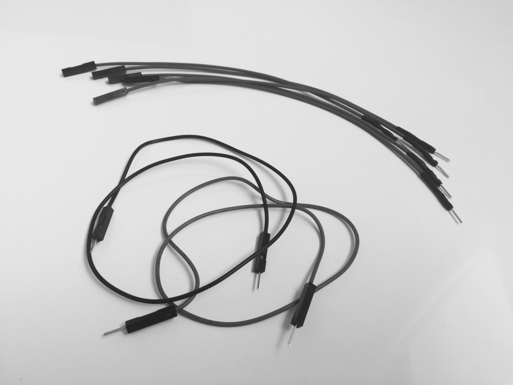

# ひと夏の恋を貴方に　〜この夏はじめる♪ストリーム処理ことはじめ〜

<<<

== What's "IoT"?

この本では「IoT」を大きなテーマとして掲げつつ、個人個人で好きな物についてぐーたら、 +
でも真面目に書いています。が！そもそもIoTってなんだっけ？というのは大事かなと思いますので +
IT初めての女子でも分かるように定義しておこうかなと思います。 +

== IoTとは
「そもそもIoTって何？」「っていうか言葉すら初めて聞いた」というあなた。 +
IoTとは”Internet of Things”の略称です。直訳すると「インターネットに繋がるもの」となります。 +
パソコンやサーバ（Google検索などインターネット上で動作するアプリを動かすためのパソコン）など +
ITに関係しているもの以外の”もの”がインターネットに繋がっている状態を”IoT”と言っているんですね。 +

== 全ての”もの”をインターネットに
“もの”がインターネットに繋がるとはどういうことでしょうか。 +
むしろそんなものあるのか、と考えた方もいらっしゃるかもしれません。ものだけに。 +
“もの”の定義は人によって曖昧なことが多いのが現状です。 +
今のところは、この世の中に存在する道具や生き物は”もの”として捉えて良いでしょう。 +
人も“もの”にあたるのか？と聞かれるとちょっと答えに迷ってしまうところはありますが。 +

== 生き物すらインターネットに繋がる時代
生き物がインターネットに繋がると聞いて驚かれる方もいらっしゃるかもしれません。 +
そうです、IoTを駆使すれば生き物の生態や状態を観察することができる時代になったのです。 +

植物を例にとって考えてみましょう。 +
今までの植物のお世話といえば、土が乾いていないか自分で確かめることが一般的でした。 +
水やりをしても大丈夫か判断するためには、直接プランターやポットの土を触って確かめますよね。 +
水やりを忘れた挙句、土がカラカラに乾いていることに気づいたときにはもう手遅れ…。 +
こうして花の命ははかなく散ったと言う経験をされた方は多いと思います。 +

しかし、IoTを駆使すれば花の水やりを効率よく進めることができるようになります。 +
例えばプランターに「土壌湿度センサー」を取り付けます。 +
そうすると、「土壌湿度センサー」は土の中に含まれている水の量を測ってくれます。 +
水の量が少なくなった場合またはスマホにメール送信するといった仕組みを作っておけば、 +
水やり忘れで植物を枯らすということも無くなります。なんだか便利そうな感じがしてきましたね。 +

また、動物のお世話にIoTを活用している事例もあります。 +
ペットの首にGPSセンサー付きの首輪をつけていれば、迷子になった時もスマホで探すことができます。 +

他にも動物の動きに法則性があれば、動物がいつ、どんなことをしたか分かるようになります。 +
最近では牛の首に加速度センサー（ものがどの位の速さで動いたか検知できるもの）を巻きつけておき、 +
牛の首振り運動が早くなったら発情期と判断するような研究を進めているところもあるそうです。 +

== とりあえず物が繋がっていれば、それはもうIoT
IoTの守備範囲は意外と広いということは感じていただけたでしょうか。 +
重くて大きいパソコンに頼らずとも、”もの”が持っている情報をやり取りすることができるのです。 +
ITの世界に普段触れない人からすると、何ができるのかさっぱり分からないと感じるでしょう。 +
IoTでは”もの”・IoT用のデバイス（センサーなど）・パソコンと3つの世界を使い分けています。 +
実際に目に見えるものを動かして楽しむことができるのがIoTの魅力です。 +

だんだん興味出てきたと思いません？ +

== 女の子の生活にもIoTは存在する
「でもーITなんで枯れたおっさんがやるもんでしょ」「アキバはオタクがいっぱいいるからなー」 +
そんなことを思う流行追っかけ女子もいらっしゃるかもしれません。 +

確かに秋葉原のパーツショップのお客さんは大半が男性で構成されているのは間違いありません。 +
女性にとって居心地がいい！と言い切るのは正直…難しいです。 +
しかし、IoT技術は女子にとって身近なところに使われています。アキバに行かなくてもIT体験はできる！ +

.自動販売機
JRをよく利用する方はちょっと黒くて大きめの自動販売機を見たことがあるのではないでしょうか。 +
新しめの駅なら必ず置いてあります。 +
若い子が行き交う渋谷や、流行に敏感な女子が沢山いる原宿にもありますね。 +
この自販機は一見普通の自販機のように思えますが、IoT技術がフル活用されています。 +
この自販機は、人が近くにいるかを自分で判断することができます。 +
人感センサーやカメラ認証で人が近くにいることを検知し、自販機の画面の切り替えを行います。 +
さらに、インターネット上にある天気の情報やカメラに映る人の姿からオススメの飲み物を判断し、 +
画面に映し出す機能も備えています。今までの自販機では考えられなかったことです。 +
これもIoT技術によって自販機という”もの”とインターネットが繋がっているからこそできるサービスと言えるでしょう。 +

.商業ビル内のパネル
もっと女子の身近な例で何かないの？と思われる方もいらっしゃるかもわかりませんが、 +
実は女子がよく行くスポットにもIoT技術が使われています。 +
ルミネやパルコ、マルイなどの商業ビルに行くと、たまに人が通ると反応する案内板を見たことがあるかと思います。 +
人が通ると反応するだけではなく、パネルをタッチするとフロアマップが出てきたり、オススメの洋服を提示したりしてくれます。 +
これも人感センサーやカメラを使って人の存在を検知し、インターネットを介してフロアや服の情報を取得していると言えそうです。 +

== とりあえずセンサー買っちゃお☆
兎にも角にも、意外と身近な世界にIoTが存在していることはお分かりいただけたでしょうか。 +
モノがインターネットに繋がっているのはもはや当たり前の時代というわけです。 +
ただ、「IoTが身近にあるのはわかったけれど、結局自分じゃコントロールできないし？」とお考えになってらっしゃるかもしれません。 +
が、そんなことは全くありません。 +
最近のIoT体験グッズはとても充実しているので、初期投資4000円くらいで始めることができます。 +

.何を準備したらいいの？
自分で好きにカスタマイズ・作成できるIoTグッズの代表格と言えばセンサーです。 +
で、そのセンサーと組み合わせて使うのが「マイコン」と言われる小さなコンピューターだったりします。 +
代表的なものとして「Raspberry Pi」「Arduino」などがありますが、個人的なオススメのものは「Arduino」です。
理由は2つあります。 +

* 安い +
* セットアップが簡単 +

.安い
Arduino本体は1つ3000円前後で買うことができます。 +
対するRaspberry Piですが、4000円から6000円程度かかります。 +
1000円あれば同人誌を２冊買えます。初期費用はやっぱり安く抑えたいですよね。 +

.セットアップが簡単
Arduinoは基盤とIDE（統合開発環境）のみで動作させることが可能です。 +
ちなみにIDEとは自分で書いたプログラムが合っているか確かめたり、 +
パソコンが読めるような言語に書き換えたりしてくれる素晴らしいソフトウェアのことです。 +
こう書くとなんだか一種の宗教みたいですね。どうでもいいんですけど。 +

それに対してRaspberry PiはRaspberry Pi専用OS（WindowsとかMac OSみたいなもの）を +
SDカードに焼き付けるところから始まります。 +
Raspberry Pi自体の操作をするためにはキーボードやディスプレイを準備して繋ぐ必要があります。 +
さらに無線環境を準備して、OSインストールして、rpmコマンドで最新化もやって…なんてなるともう気が遠くなってきます。 +

初めて触る人にとってはハードルが高すぎてクラクラしてしまいそうです。 +
普段ITと無縁な世界で過ごしている人や、これからIoTやってみようかな〜なんて考えている方は +
Raspberry Piの利用は避けた方が良さそうです。 +

.RaspberryPi 2。手のひらからはみ出るくらいのサイズです

.こっちはArduino UNO。中身は全然違うのに、結構似ているかも…

…というわけで、今回はArduinoを使うことにしましたが、他にも準備するものは色々あります。 +
代表的なものをいくつか挙げてみます。 +

.USBケーブル
　Arduinoとパソコンを繋ぐのに必要です。Arduino用と書いてあるものを購入すれば大丈夫です。 +

.抵抗（とりあえず10・220Ω）
電気の強さを調整するのに使います。電子パーツを扱っているお店に行くと大量に売っています。 +

.抵抗。絶対直角に曲げるのなんて無理。
 +

.ジャンパーワイヤ（オスーオス）
Arduinoとセンサーを繋ぐ回路として使います。 +
オスというのは先っぽが尖っていて何かに刺せるもの、メスは尖った部品がないもののことを指します。 +
なんでオスメスで識別するのかは永遠の謎です。 +
誰がこんな識別方法にしようって言い出したのか200時間くらい問い詰めたい。 +

.手前がオス-オスのジャンパーワイヤ、奥はオスーメスのジャンパーワイヤです。

.ブレッドボード
Arduinoとセンサーを繋ぐ回路として使います。 +
これを使うと半田付けなしでセンサーとArduinoを繋ぐことができます。 +
何回でも、いつでも、どんな時でも抜き差しできるので便利。 +

.ものによりけりだけど、Arduinoより一回り大きい。数字があったほうが使いやすいと思います。

.LEDライト
一番初めの動作確認や、回路の状態を確かめるのに使うことができます。 +
赤・白・緑など、色々な色（決してダジャレではない）があるので好きなものをどうぞ。 +

.ものによっては結構お値段が張るLED。みんな光り物好きだよね。

.使いたいセンサー
やりたいことに合わせて好きなセンサーを買いましょう。 +
っていうかこれがないと始まらないっす！今回は温度を測るセンサーを使います。 +
「準備する物が多くてめんどくさ〜い」という人はArduinoのスターターキットを買うのがオススメです。 +
Amazonで15000円だすとセンサー等20パーツ＋説明書（英語/日本語）を一緒に購入できます。 +

.センサーがいっぱいです。こんな感じで袋に入っていることが多いですが、小さいので無くさないように。 +

.どこで買ったらいいの？
秋葉原が近い人は秋月電子にいけば間違いありません。 +
が、平日でも満員電車並みに混んでいるのであまりオススメできません。安いんですけど。 +
なのでIoTグッズに強いネット通販を利用するのがいいと思います。 +
スターターキットを購入するか、Amazonで入門パックを探してみるのが良いでしょう。 +

== まとめ
いかがでしたでしょうか。IoT技術によって“もの”がインターネットに繋がっていることと、 +
それを活用して色々なサービスができていることがお分かりいただけたかと思います。 +
日本だとブームが終わると技術も衰退するような印象があります。 +
でも、IoT技術は今後色んなところで使われていくこと間違いなしです。 +

IoTを駆使すれば自作ラジコンや自動水やり機など色々なものが作れます。 +
まだまだ可能性は無限大です！この本を読んでくださった方が秋葉原の電気街に行ってみよー、 +
とかIoTと得意なスキルを組み合わせてみよー、とか思ってくれたら嬉しいです。
